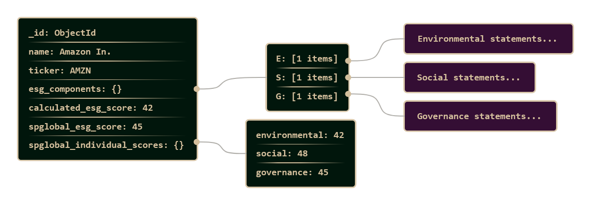

# Database Documentation

## Overview

The ESG Assessment Tool uses MongoDB as the primary database for storing company data, ESG components, and ESG scores. The database runs in a Docker container and is managed through a Python abstraction layer.

## Database Structure

### MongoDB Schema

The main collection `companies` in the `company_db` database stores company data with the following schema:

```json
{
  "_id": "ObjectId",
  "name": "Company Name",
  "ticker": "Stock Symbol",
  "esg_components": {
    "E": ["Environmental statements..."],
    "S": ["Social statements..."],
    "G": ["Governance statements..."]
  },
  "calculated_esg_score": null,
  "spglobal_esg_score": 45,
  "spglobal_individual_scores": {
    "environmental": 42,
    "social": 48,
    "governance": 45
  }
}
```



## Database Class

The `Database` class in `databaseAccess/database.py` provides an abstraction for MongoDB operations:

### Connection

- **Host**: localhost:27017
- **Username**: root
- **Password**: example
- **Database**: company_db
- **Collection(s)**: companies

### Main Functions

#### Company Functions

- `add_company(name, ticker)`: Add new company
- `get_company(company_id)`: Retrieve company by ID
- `get_company_id_by_name(name)`: Find ID by company name
- `get_company_id_by_ticker(ticker)`: Find ID by ticker
- `list_companies()`: List all company names

#### ESG Data Functions

- `add_esg_component(company_id, category, statement)`: Add ESG component
- `set_calculated_esg_score(company_id, score)`: Set calculated ESG score
- `set_spglobal_esg_score(company_id, score)`: Set S&P Global ESG score
- `set_spglobal_individual_scores(company_id, environmental, social, governance)`: Set individual ESG scores

## Database Migration

### Why Migration is Necessary

Database migrations are required when:

1. **Schema Changes**: New fields need to be added to existing documents
2. **Data Structure Updates**: Existing data structures need to be adapted to new requirements
3. **Consistency**: All documents must use the same schema

Therefore when we change the Datbase Scheme we must also migrate older data.

### Running Migration

#### 1. Automatic Migration via Script

```bash
cd DataColector/src/databaseAccess
python migrate_db.py
```

#### 2. Manual Migration

The `migrate_old_entries_to_new_schema()` function can be called directly:

Example:

```python
from databaseAccess.database import Database

db = Database()
db.migrate_old_entries_to_new_schema()
```

### Migration Details

The current migration (`migrate_old_entries_to_new_schema`) performs an `update_many` on all documents:

```python
result = self.companies_collection.update_many(
    {},  # All documents
    {
        "$set": {
            "calculated_esg_score": None,
            "spglobal_esg_score": None,
            "spglobal_individual_scores": {
                "environmental": None,
                "social": None,
                "governance": None
            }
        }
    }
)
```

## Backup and Restore

Backups ar eimportant because the scrapping and manipulation of the ESG-Data from the pdfs can take couple of hours.

### Creating Database Backup

```bash
# MongoDB Backup with mongodump
mongodump --host localhost:27017 --username root --password example --db company_db --out ./backup

# Or via Docker
docker exec mongo-container mongodump --host localhost --username root --password example --db company_db --out /backup
```

### Restoring Database

```bash
# MongoDB Restore with mongorestore
mongorestore --host localhost:27017 --username root --password example --db company_db ./backup/company_db

# Or via Docker
docker exec mongo-container mongorestore --host localhost --username root --password example --db company_db /backup/company_db
```

## Docker Configuration

The MongoDB instance runs in a Docker container, configured through `docker-compose.yml`:

### Starting Container

```bash
cd dbConfig
docker-compose up -d
```

## Best Practices

1. **Always create backups** before schema changes
2. **Test migrations** in a development environment
3. **Use indexes** for frequent queries, e.g. for ESG Data
4. **Ensure consistent schema updates** through migrations
